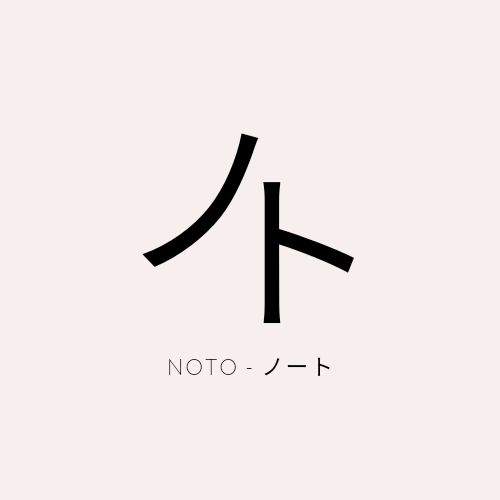
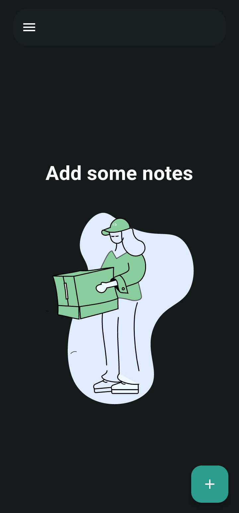
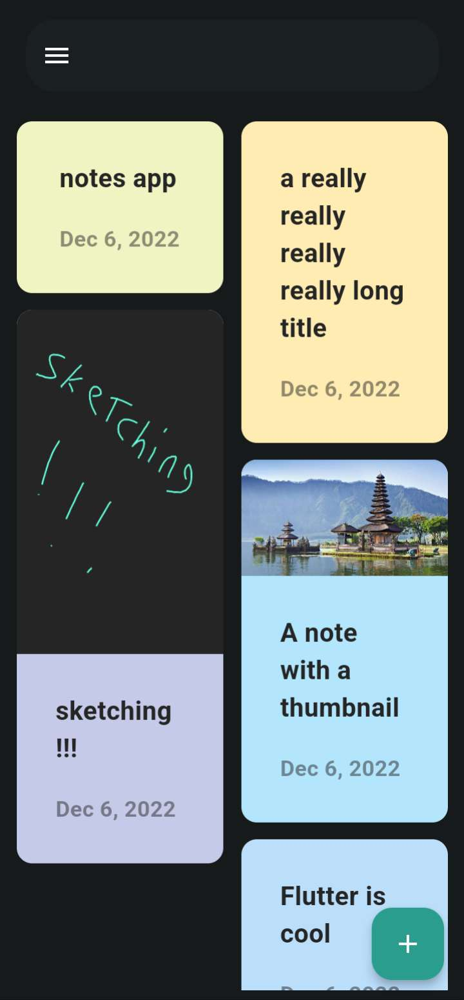
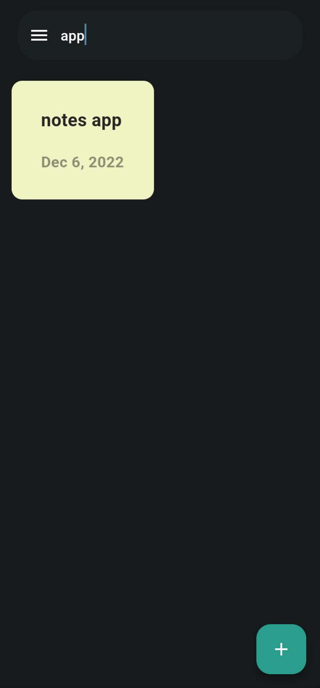
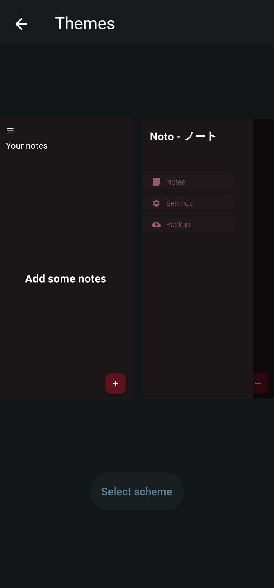

# Flutter Note-Taking app 

 

⭐️ the repo if you love it.

## Getting Started 🚀

- Clone the repo
- Install the dependicies
- Run it

## Features 💡

- Taking quick notes
- Sketching what comes in mind
- Adding a photo to your note
- Dark/Light mode plus 3 different color themes
- Searching notes

## Preview 📸

|                                           |                                           |                                           |
| ----------------------------------------- | ----------------------------------------- | ----------------------------------------- |
|  |  |  |
|  |  |  |

## Contact me 📧
#### Email : hm834806@gmail.com
